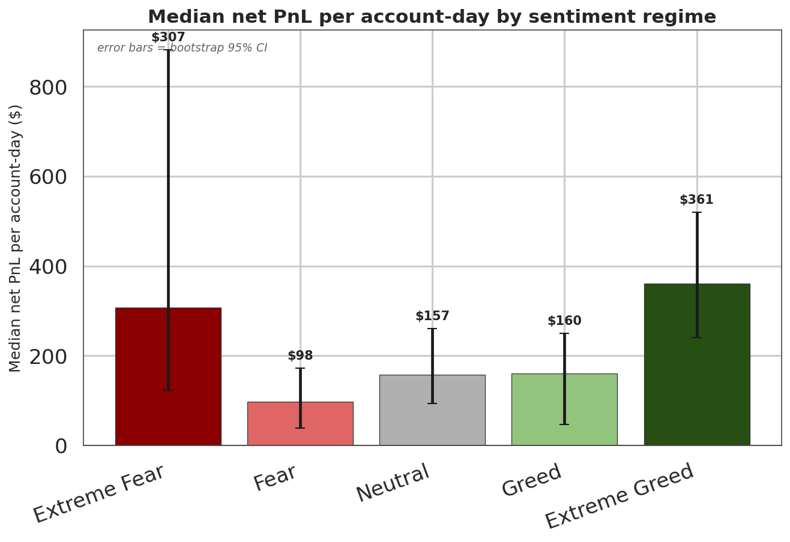
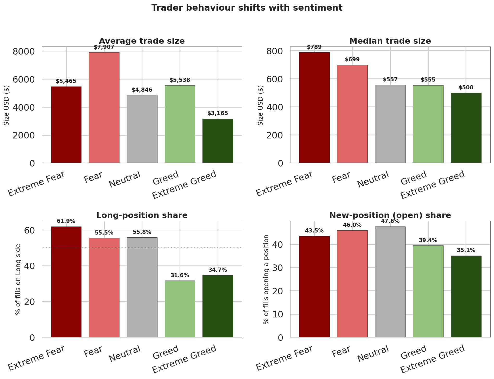

# Trader Performance vs. Bitcoin Market Sentiment

Analysis of **211,224 Hyperliquid trade fills** (32 accounts · 246 coins · May 2023 – May 2025) against the **Crypto Fear & Greed Index** — submitted for the Primetrade.ai data-science screening task.

> **TL;DR** — Trader performance is **U-shaped** in sentiment: this cohort earns its best returns at the **extremes** (Extreme Fear *and* Extreme Greed) by acting as disciplined contrarians, while the obvious "Fear vs Greed" split carries **no** statistical signal.

---

## Key findings

| # | Finding | Evidence |
|---|---------|----------|
| 1 | **Performance is U-shaped, not monotonic.** Median net PnL/account-day peaks at **Extreme Greed (\$361, 67.7% green days)** and **Extreme Fear (\$307, 64.9%)**, and troughs at plain **Fear (\$98)**. | Kruskal–Wallis **p < 0.001** (5-class) |
| 2 | **The binary "Fear vs Greed" split is a trap** — there is no significant performance gap. The edge is sentiment *intensity*, not direction. | Mann–Whitney **p ≈ 0.09**, Cliff's δ ≈ −0.05 |
| 3 | **These traders are contrarians.** Long-position share falls **62% → 32%** from Extreme Fear to Greed; trade size is largest in Fear (\$7.9k vs \$3.2k in Extreme Greed). | behaviour panel |
| 4 | **Skill concentrates at the extremes.** The top cohort earns a median **\$2,483/account-day in Extreme Fear** vs **\$107** for the bottom cohort. | cohort split |
| 5 | **Disciplined risk.** Liquidations are <0.02% of fills even in Greed; **+\$10.05M** net realized over two years. | `Direction` flags |





---

## Start here

- **[`notebook_1.ipynb`](notebook_1.ipynb)** — the full narrated analysis.
- **[`outputs/notebook_1.html`](outputs/notebook_1.html)** — pre-rendered, **no setup required**.
- **[`report/ds_report.pdf`](report/ds_report.pdf)** — 3-page research-note summary.

## Repository layout

```
primetrade-trader-sentiment/
├── notebook_1.ipynb          # main narrated analysis (runs top-to-bottom, seeded)
├── README.md
├── requirements.txt
├── src/
│   ├── utils.py              # load / clean / the join / non-parametric stats helpers
│   ├── plots.py              # shared charting (used by the script AND the notebook)
│   ├── fetch_sentiment.py    # fetch Fear & Greed (official Drive file, API fallback)
│   ├── prep_and_validate.py  # build & VALIDATE the join -> integrity report
│   ├── analysis.py           # all statistics + regenerates every chart
│   └── build_notebook.py     # assembles notebook_1.ipynb
├── csv_files/                # fear_greed_index.csv, account_day.csv  (raw historical_data.csv not committed — too large)
├── outputs/                  # committed PNG charts, stats_summary.json, notebook_1.html
└── report/ds_report.pdf
```

## Reproduce it

```bash
pip install -r requirements.txt
# Place the raw dataset at csv_files/historical_data.csv (not committed — too large for GitHub)

python src/fetch_sentiment.py        # refresh sentiment (already committed; optional)
python src/prep_and_validate.py      # build + validate the join, print integrity report
python src/analysis.py               # all stats + charts -> outputs/
python src/build_notebook.py         # (re)assemble the notebook
jupyter nbconvert --to notebook --execute --inplace notebook_1.ipynb
```

## Why the method is defensible

The assignment is fundamentally a **join** — connect each trade to that day's sentiment regime — so the project is built around getting that right:

- **Time:** the numeric `Timestamp` column is corrupted (Excel scientific-notation), so time is taken from the full-precision `Timestamp IST` and converted **IST → UTC** (the index rolls at 00:00 UTC). 100% of trades match a sentiment day.
- **Performance:** **net realized PnL = `Closed PnL − Fee`**, on the ~49% of fills that close a position.
- **Statistics:** PnL is violently fat-tailed, so every comparison uses **medians + non-parametric tests** (Mann–Whitney, Kruskal–Wallis, paired Wilcoxon) with **bootstrap 95% CIs** and **sample sizes reported on every cell**.
- **Honesty:** framed as **association, not causation** (BTC price drives both); the missing `leverage` column is replaced by a flagged size proxy, never fabricated; no overfit backtest is claimed (no clean price series — see notebook §9).

## Limitations

32 accounts (a cohort, not the market) · closed-PnL survivorship · no true leverage · Extreme Fear is the thinnest cell (14 calendar days) · sentiment is market-wide while trades span 246 coins. Full discussion in notebook §10.

---

*Richik Chaudhuri — Data Science, BMS College of Engineering. Built for the Primetrade.ai hiring assignment.*
